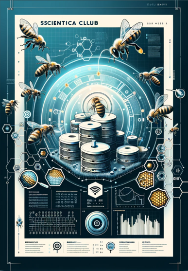

# Koło naukowe - Technika w służbie przyrody, Gdzie LoRa spotyka dziko żyjące pszczoły

  

Hej, przyszli innowatorzy! Chcecie rozwinąć swoje skrzydła w świecie nauki i technologii? Dołączcie do naszego projektu "bUZz_tech" w Kole Naukowym Uniwersytetu Zielonogórskiego!

# Co robimy?
Tworzymy coś niesamowitego - system monitoringu dla dziko żyjących pszczół w barciach (nie ulach) rozmieszczonych w lasach dookoła uniwersytetu. 

# Nasz cel?
Zbieranie danych o środowiskowych wewnątrz ula i przesyłanie ich przez protokół LoRa a następnie zapis w bazie danych i wizualizacja, a może i trochę AI ;)

# Co zyskasz?
* **Wiedza praktyczna**: Zanurzysz się w projektowanie elektroniki i pisanie oprogramowania - od pomysłu po realizację.
* **Technologie przyszłości**: Dowiesz się więcej o LoRa i jak to działa w prawdziwym świecie.
* **Wsparcie ekspertów**: Nasi prowadzący to mieszanka doświadczenia akademickiego i praktycznego. Wykładowcy uniwersyteccy i doświadczeni programiści embedded będą Twoimi mentorami.
* **Rozwój osobisty i zawodowy**: Zdobędziesz umiejętności, które uczynią Cię cennym specjalistą w przemyśle zaraz po zakończeniu studiów (A może i w trakcie!).
* **Przyczynisz się do czegoś ważnego**: Twoja praca pomoże w ochronie i zrozumieniu zachowań pszczół, co jest kluczowe dla naszego ekosystemu.

# Dla kogo?
Dla każdego studenta zainteresowanego technologią, elektroniką, programowaniem, a także naturą i ekologią. Niezależnie od tego, czy jesteś początkujący czy zaawansowany - jest miejsce dla Ciebie!

# Jak się dołączyć?
Wpadnij na zajęcia oranizacyjne w sali **115, 16.11 (czwartek) o godz. 16:15**.

# Więcej szczegółów
Możesz zobaczyć naszą prezentację, żeby dowiedzieć się więcej!

Do zobaczenia!

